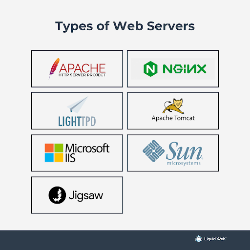

# Demystifying the Project

## Q&A

### 1. What is a web server?

A **web server** is a software application that handles requests from clients (like web browsers) and delivers web content, such as *HTML* pages, images, and files, over the internet using protocols like HTTP or HTTPS. For example, when visiting, a site an Apache server retrieves and sends web pages files to your browsers. 

### 2. What are some web servers?

Web server applications include **Apache HTTP Server** (open-source, runs on Linux, Windows, and macOS, download at httpd.apache.org, latest version 2.4.x), **Nginx** (open-source, available on Linux, Windows, macOS, download at nginx.org), and **Microsoft IIS** (proprietary, runs on Windows, available via Windows Features, latest version 10). Each serves web content but differs in features such as performance tuning and built-in modules.​ 

### 3. What is virtualization?

Virtualization is the process of creating virtual versions of physical resources like servers, storage devices, or networks, allowing multiple systems to share a single platform efficiently 

### 4. What is VirtualBox?

VirtualBox is a free open-source software developed by Oracle that enables users to run multiple operating systems as virtual machines on one physical computer. It works, on Windows, macOS, Linux and Solaris.

### 5. What is a virtual machine? 

A virtual machine is an isolated operating systems that operates from the host machine, with its own operating system and applications. For example, running a Linux VM inside Windows allows to use both OS simultaneously.

### 6. In virtualization, what does Host machine and Guest machine mean?

- **Host Machine:** The host machine is the physical computer running virtualization software.

- **Guest Machine:** The guest machine is the virtualized environment that operates independently within the host.

### 7. What is Debian?

Debian is a popular, stable, open-source Linux operating system known for its vast repositories and free software philosophy. It is the foundation for many other distributions, like Ubuntu.

### 8. What is a Firewall?

A **firewall** is a security system (either hardware or software) that monitors and controls import and export of networking traffic based on predetermined rules, helping protect networks from cyberattacks. For instance, home routers often include a built-in firewall to block unwanted connections. 

### 9. What is SSH?

**SSH**, aka **Secure Shell** is a cryptographic network protocol used to securely connect to remote systems over an unsecured network, enabling command-line access and secure file transfers. They are often used to manage remote Linux servers.

### 10. What is an IP address?

An **IP address** is a unique identifier assigned to each device that enables the connection to the internet and web services, and local networks. For instance, your computer might have an IP address like *192.168.1.10*.

### 11. What is a Network Mask?

A **network mask** (subnet mask) defines which portion of an IP address identifies the network and which part identifies the device within that network. For example, the subnet mask *255.255.255.0* with IP 192.168.1.15 means 192.168.1 is the network, .15 is the device.

### 12. What is a port? 

A **port** is a numerical endpoint for network communications on a device, allowing multiple types of data (such as web pages and emails) to be send and received simultaneously. Here is a list of the most common port numbers and their functions:

**Web and Email**

  - 80: Hypertext Transfer Protocol (HTTP)
  - 443: Hypertext Transfer Protocol Secure (HTTPS)
  - 25: Simple Mail Transfer Protocol (SMTP) for sending email
  - 110: Post Office Protocol version 3 (POP3) for receiving email
  - 143: Internet Message Access Protocol (IMAP) for managing email 

**Remote Access and System**

-   22: Secure Shell (SSH) for secure remote connections
- 23: Telnet for unencrypted remote connections (less secure)
- 53: Domain Name System (DNS) for translating domain names to IP addresses
- 3389: Remote Desktop Protocol (RDP) for remote control 

**File Transfer**

- 20: File Transfer Protocol (FTP) Data
- 21: File Transfer Protocol (FTP) Control
- 989/990: FTP over SSL/TLS (FTPS) 

### 13. What is port forwarding?

**Port forwarding** is a networking process that redirects communication requests frorm one address and port number combination to another, often used to allow external devices access to services on a private network. For instance, forwarding port 22 on your router lets you SSH into your home computer from outside.

### 14. What is a localhost? 

Localhost refers to the loopback network interface (usually the address 127.0.0.1) on a computer, allowing software to communicate with itself or test services without external network access. \

### 15. What does this 127.0.0.1 address represent? 

The IP address **127.0.0.1** is the standard loopback address for the local computer, meaning any network requests sent to it are handled internally by the same device. This allows for testing or inter-process communication without external traffic.

### 16. What is Git?

**Git** is a distributed version control system that tracks changes in source code during software development, allowing developers to collaborate, manage project history, and revert to previous states efficiently. It is widely used for programming projects.

### 17. What is Github?

GitHub is an online platform and service for hosting Git repositories, providing collaboration tools, issue tracking, code review, and project management features for software development teams. It enables sharing and contributing to open-source and private projects. 

