# Deliverable 2

## 1. What are the server hardware specifications? 

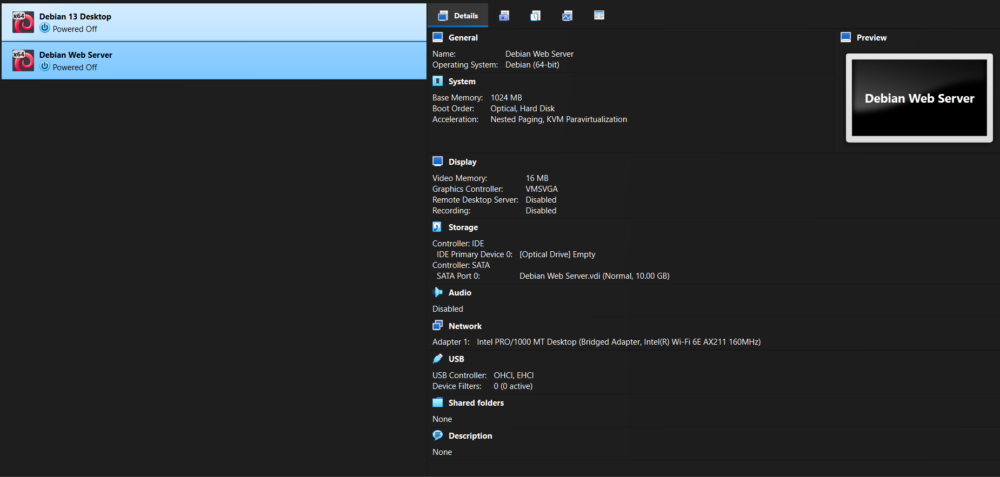

## 2. What is the Debian Login Screen?

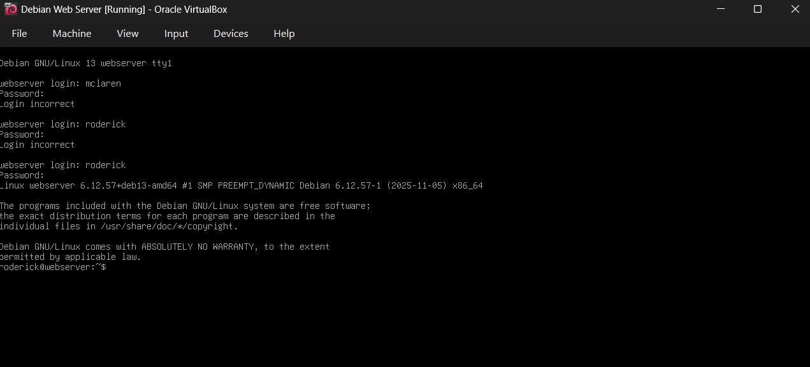

## 3. What is the IP address of the Debian Web Server Virtual Machine?

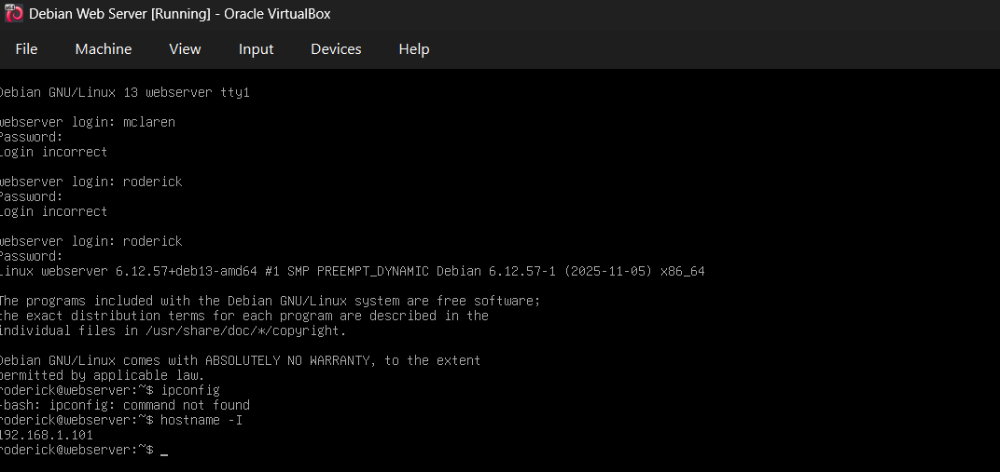

## 4. How do you work with the Firewall in Debian?

In Debian, managing a firewall is usually handled by iptables/nf-tables, but in my experience I used **UFW** (Uncomplicated firewall), which is easier to configure since it uses a simpler interface. UFW is vastly used on web servers due to its simplicity.

**Commands:**

- To install UFW:
    - `sudo apt install ufw`

This command installs the packages for UFW.

- Checking the firewall status: 

    - `sudo ufw status` It displays whether the firewall is active and shows the current rules.

- To enable the firewall:

    - `sudo enable ufw` It activates the firewall and applies all configured rules.

- To allow full web traffic:

    - `sudo ufw allow 'WWW Full'` It allows both HTTP and HTTPS.

- To allow the secure shell:

- `sudo ufw enable 'OpenSSH'` It allows incoming SSH connections on port 22.

## 5. What different commands do we use to work on Apache?

### 1. What is the command to check if Apache is running?

- The command is: `systemctl status apache2`

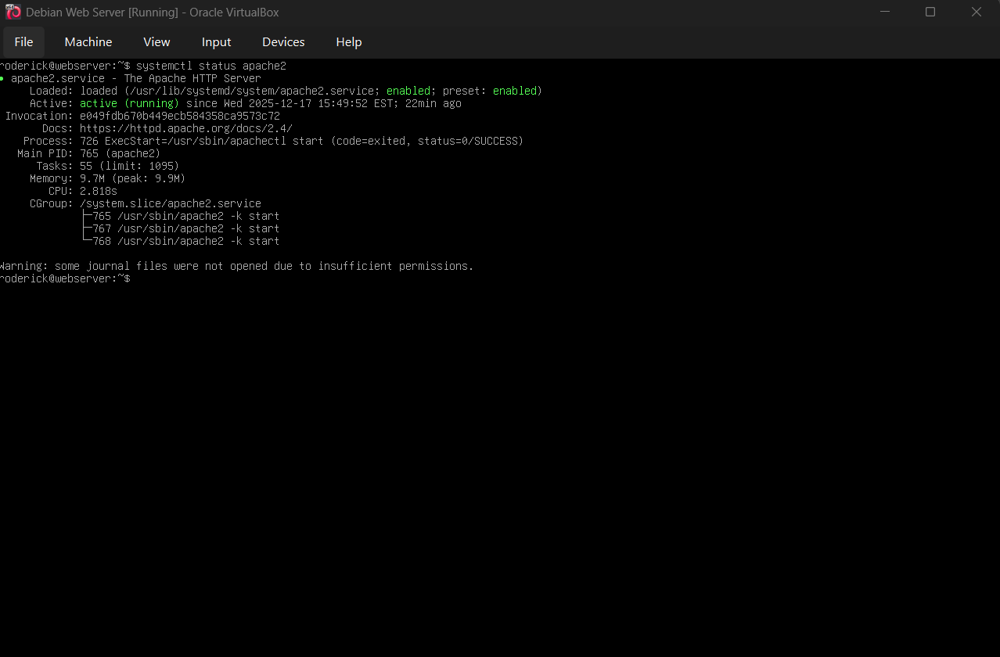

### 2. What is the command to stop Apache?

- The command is: `systemctl stop apache2`

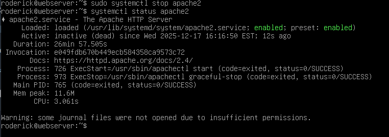

### 3. What is the command used to restart Apache?

- The command is: `sudo systemctl restart apache2`

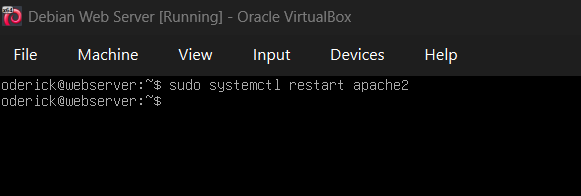

### 4. What is the command used to test Apache configuration?

- The command is: `apachectl configtest`

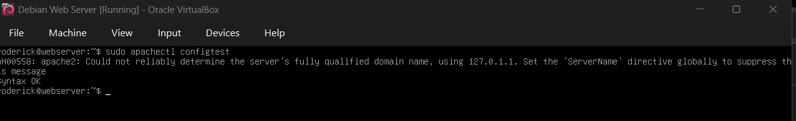
### 5. What is the command to check the installed version of Apache?

- The command is: `apache2 -v`

### 6. What are some common configuration files for Apache?

- Apache stores many configuration files like:
    - `apache2.conf`
    - `ports.conf`
    - `sites-enabled/`
    - `sites-available/`

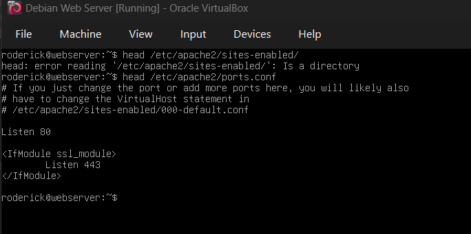
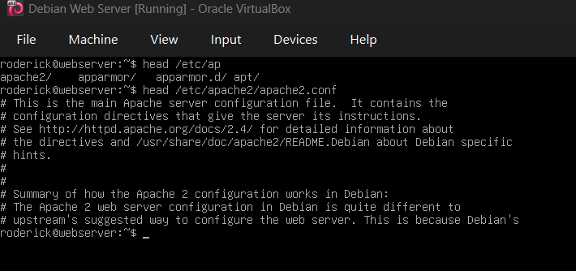

### 7. Where does Apache store logs?

Apache stores Logs in the **/var/log/** directory.

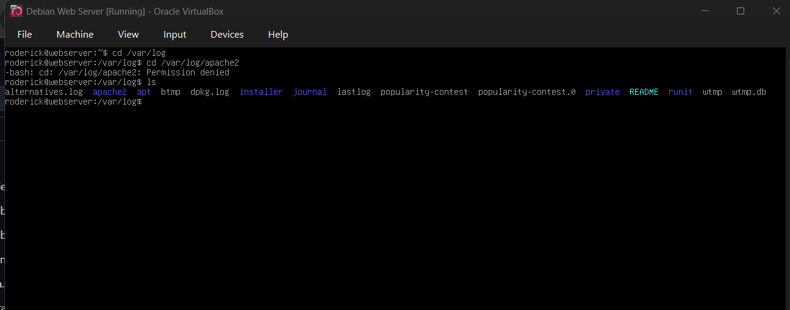

### 8. What are some basic commands we can use to review logs?

To review logs we can use commands to read files. Like: 

- `cat`
- `head`
- `tail`
- `tac`
- And a new one learned `less`

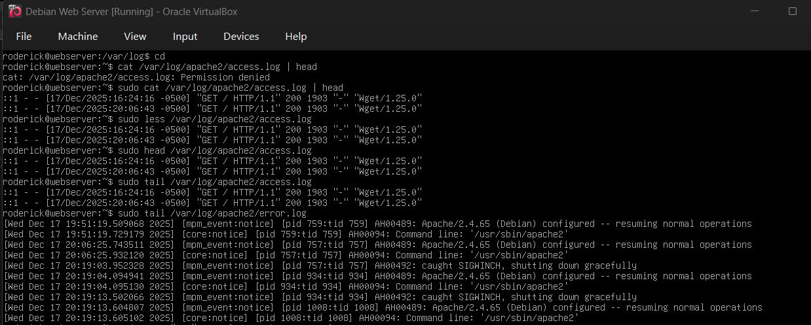
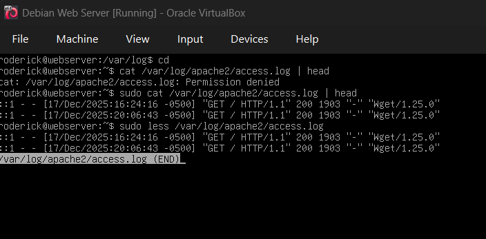

