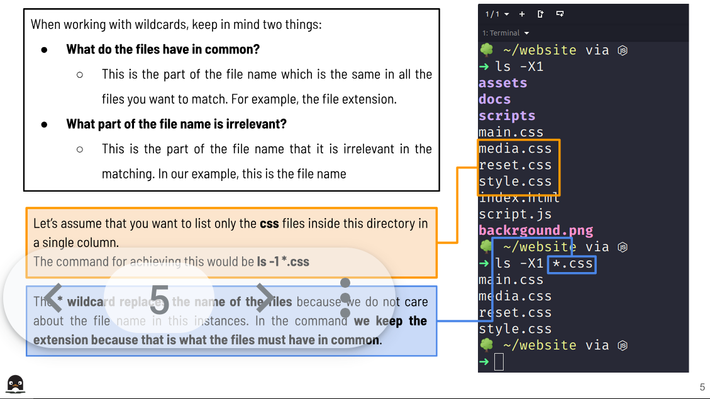
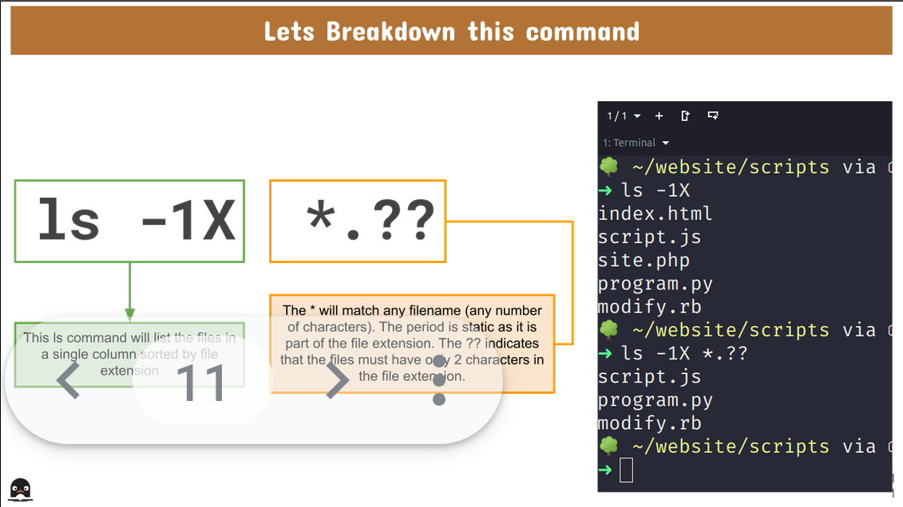
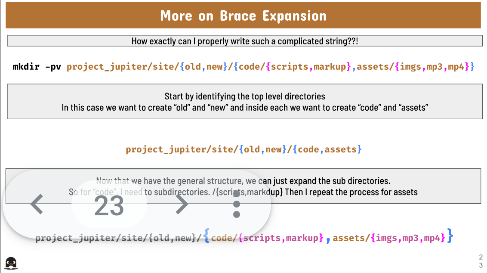

# Wildcards

### What is a Wildcard?

A wildcard is a symbol used to replace or represent one or more characters in a file name. 

There a are 3 wildcards: *, ? and [set].

### * wildcard

The asterisk (*) matches **zero or more characters** in a filename.

- Examples: 
    - List all the files in a given directory:
      - `ls Downloads/*`
    - List all text files in a given directory:
      - `ls Downloads/*.txt`
    - List all the text files in a given directory that start with the letter f
      - `ls Downloads/f*.txt`

- Example breakdown:

### ? wildcard 

The **? wildcard** metacharacter matches precisely one character. This wildcard is very useful when working with hidden files (also called dot files).

- Examples:
    - List all the hidden files in the current working directory 
      - `ls ./.??*`
    - List all hidden files in the parent directory 
      - `ls ../. ??*`
    - List all the files that have 2 characters in the file name between letters b and k
      - `ls b??k*`
    - List all the files that have a single character between letters f and l.
      - `ls f?l*`
    - List all the files with a 2 letter file extension
      - `ls *.??`

- Example breakdown: 

### [ ] wildcard

The brackets wildcard matches a single character in a range. The brackets wildcard use the exclamation mark to reverse the match. 

- Examples:
    - To match all files that have a vowel after letter f:
      - `ls f[aeiou]`
    - To match all files that do not have a vowel after letter f:
      - `ls f[!aeiou]*`
    - To match all files that have a range of letters after f:
      - `ls f[a-z]`

- More Examples: 
![[]wild]([]wild.png)

[def]: ?wild.png

### Brace expansion

**Brace expansion** is a feature of the bash shell that generates argument strings. Those strings can be used by commands to operate on files. This feature does not make calls to the operating system like wildcards, they just generate file names based on a given pattern. 

- **How to use**:
  - Start with an open brace
  - With no spaces, type your string separating entries by command 
  - Close the brace
    - Example:
      - `mkdir -pv example_site{assets/large,docs/share,scripts/js}`

- More examples:

  - Create 3 different files with the same name but different file extensions
    - `touch file.{md,txt,rtf}`
  - Create 10 files in a range from 0 to 9:
    - `touch file {0..9}.txt`
  - Remove specific files that start with a given keyword
    - `rm image_*{01..08}*camera.{png,jpg}`
  - Create an entire directory tree in a single command (1 level deep)
    - `mkdir -pv project_saturn/{code,source,database}/new`
  - Create an entire directory tree in a single command (2 levels deep)
    - mkdir -pv 
      - project_jupiter/site{old,new}/{code/{scripts/markup},assets/{imgs,mp3,mp4}}

- Example breakdown:

