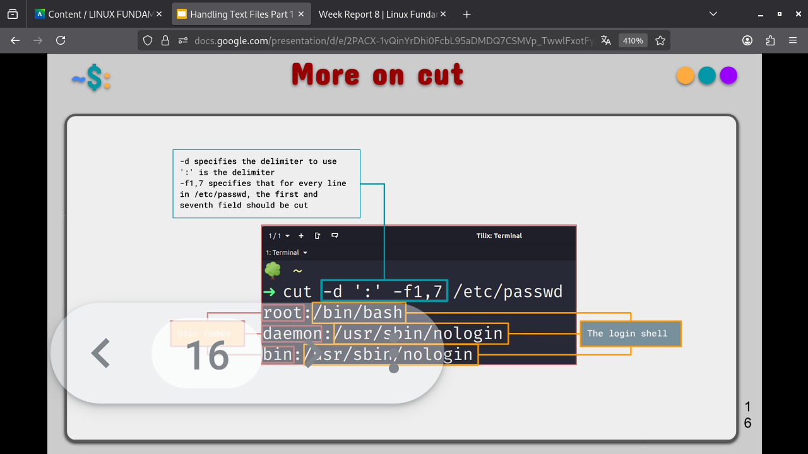
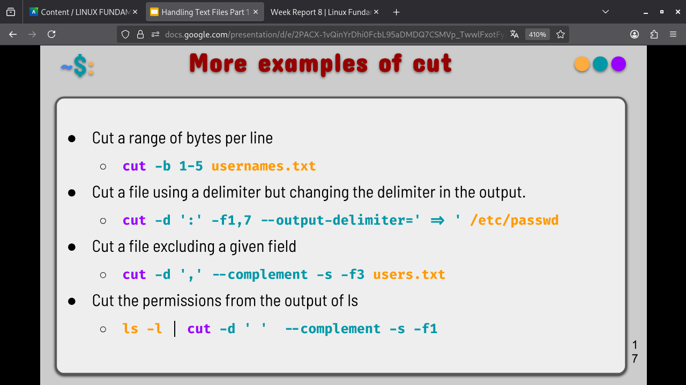

# Notes 8

## Handling Text Files 1

### cat command

The **cat** command is used to display the content of a file. Cat is short for concatenate which is the command's intended use. 

- Usage:
  - `cat + option + file(s) to display`

- Examples:
    - Display the content of a file located in ~/Documents/sample_files/:
      - `cat ~/Documents/sample_files/Code/helloworld.py`
    - Display the content of a file with line numbers:
      - `cat -n ~/Documents/sample_files/Code/helloworld.py`
    - Display the content of a file including non printing characters and line endings:
      - `cat -A ~/Documents/sample_files/Code/helloworld.py`

### tac command

The **tac** command is used for displaying the content of a file in reverse order. Just like cat, tac concatenates files and displays the output of the concatenation.

- Usage:
  - `tac + option + file(s) to display`

- Examples:
    - Display the content of a file located in ~/Documents/sample_files/ in reverse order
      - `tac ~/Documents/sample_files/Code/helloworld.py`
    - Display the content of multiple files in reverse order
      - `tac ~/Documents/sample_files/Code/helloworld.py` `tac ~/Documents/sample_files/Code/helloworld.py`

### Head command

The **head** command displays the top N number of lines of a given line. By default, it prints the first 10 lines. If more than one file name is provided then data from each file is preceded by its file name. 

- Usage:
  - `head + option + file(s)`

- Examples:
    - Display the first 10 lines of a file:
      - `head ~/Documents/Book/AsongOficeandFire.txt`
    - Display the first 5 lines of a file:
      - `head -5 ~/Documents/Book/TheHobbit.txt`

- More examples:
  - Display the first 5 lines of multiple files:
    - `head -5 ~/Documents/Book/{TheHoobit,GameofThrones}.txt`
  - Display the first line of multiple files using wildcards
    - `head -n 1 Csv/*.csv Code/*.py`
  - Display the name of a file in the output 
    - `head -v -n 7 Json/joke.json`
  - Display a given number of lines of the output of a given command
    - `ls -l ~/cis106/ | head -n 2`
  - Display a given number of bytes instead of lines:
    - `head -c 50 Txt/TheHobbit.txt`

### tail command

The **tail** command displays the last N number of lines of a given file. By default, it prints the last 10 lines. If more than one file is provided then data from each file is preceded by its file name. 

- Usage:
  - `tail + option + file(s)`
- Examples:
  - Display the last 10 lines of a file
    - `tail ~/Documents/sample_files/`
  - Display the last five lines of a file
    - `tail -5 ~/Documents/sample_files/`

- More examples:
    - In this section the examples are the same as head, just change the command.

### cut command

The **cut** command is used to extract a specific section of each line of a file and display it to the screen.

- Usage:
  - `cut + option + file(s)`

- Example:
  - Display a list of all the users in your system
    - `cut -d ':' -f1 /etc/passwd`
  - Display a list of all the users in your system with their login shell
    - `cut -d ':' -f1,7 /etc/passwd`

- Elaborating on cut:

- More examples on cut

### sort command

The **sort** command is used for sorting files. The sort command supports sorting: alphabetically, in reverse order, by number or by month. This command follows this order unless specified otherwise, like: 

- Lines starting with a number will appear before lines starting with letters
- Lines starting with a letter that appears earlier in the alphabet will appear before lines starting with a letter that appears later in the alphabet.
- Lines starting with a lowercase letter will appear before lines starting with the same letter in uppercase.

- Usage:
  - `sort + option + file`

- Example:
  - Sort a file:
    - `sort users.lst`

- More on sort:

### wc command

The **wc** command is used for printing the number of lines, characters and bytes in a file. 

- Usage:
  - `wc + option + file(s)`
- Example: 
  - Display the number of characters in a file:
    - `wc -m users.txt`
  - Display the number of lines in a file:
    - `wc -l users.txt`
  - Display the number of words in a file:
    - `wc -w users.txt`
