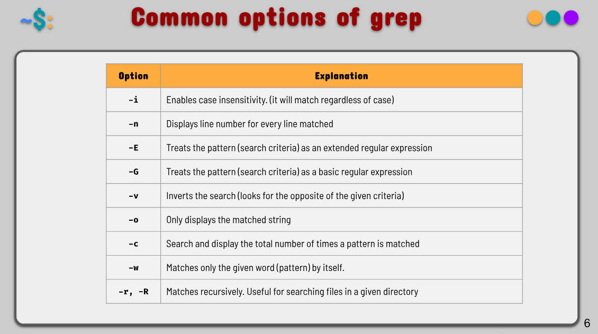
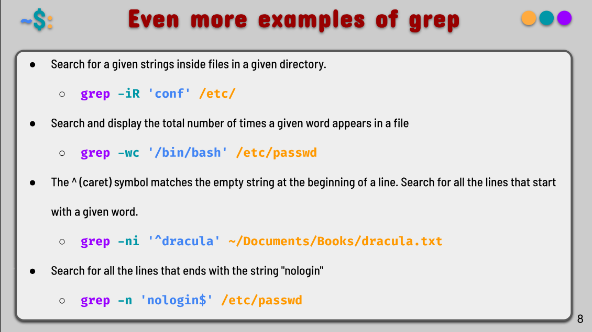
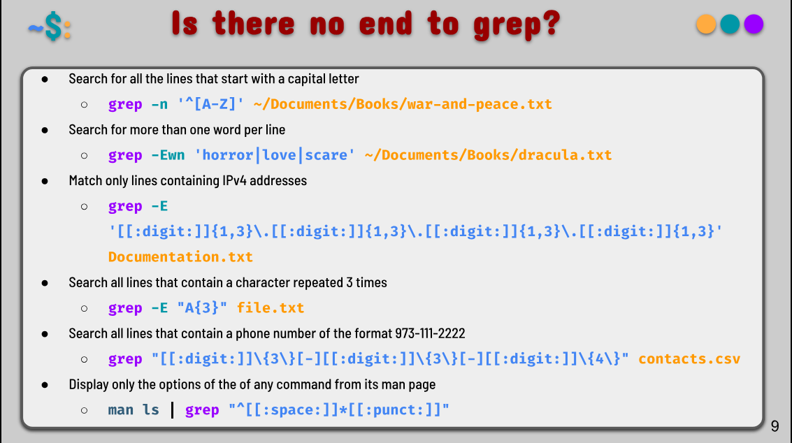
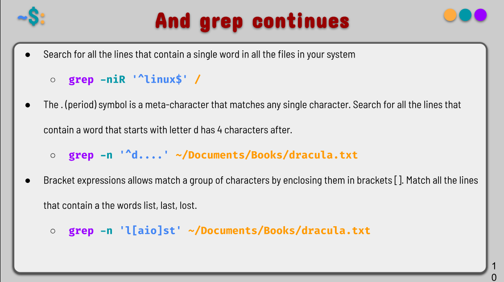
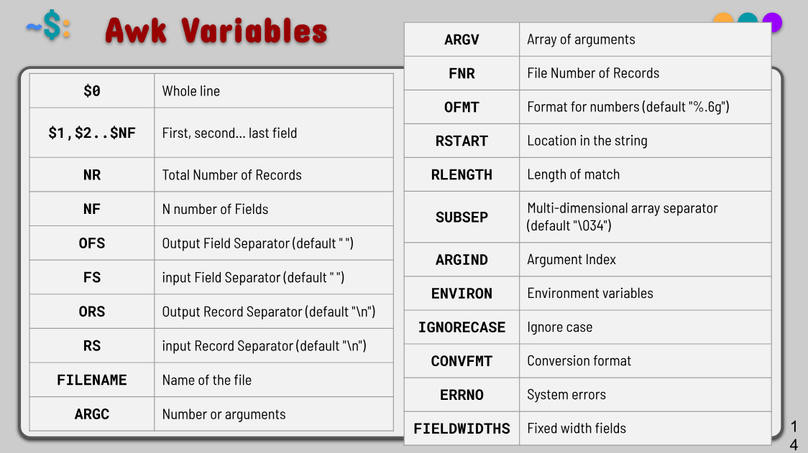
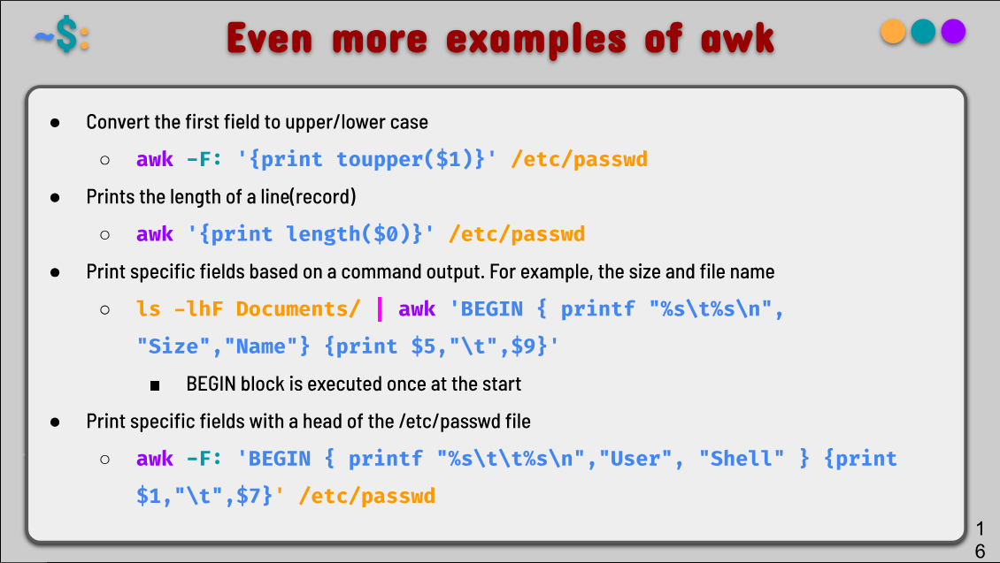
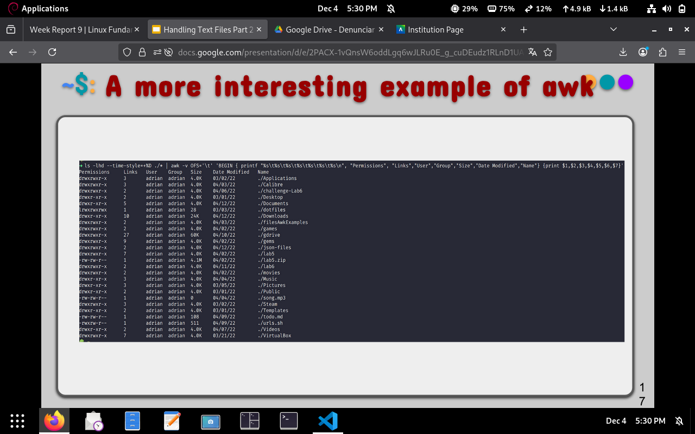
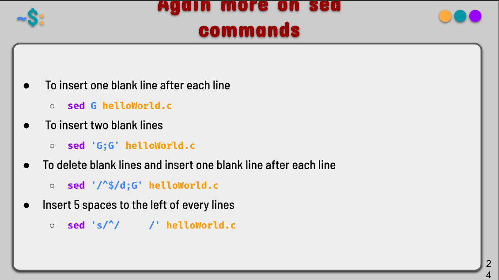

# Notes 9

## Handling text files part 2

### The GREP command 

The **grep** command is used to search text in a given file. Grep works by line basis (it matches the search criteria in a line by line basis).

- Usage:
    - `grep + option + search criteria + file(s)`

- Basic Example: 
    - Search any line that contains the word 'Game' in the given file:
      - `grep 'Game' ~/Documents/GameofThrones.txt`
    - Search any line that contains the word 'thrones' regardless of the case.
      - `grep -i 'Thrones' ~/Documents/Books/GameofThrones.txt`
    - Display how many lines contain the matched string:
      - `grep -c 'Game' ~/Documents/Books/GameofThrones.txt`

- More options for `grep`:

- More examples of `grep`

  - Search any line that contains the word dracula regardless of case and with number line:
      - `grep -in 'dracula' ~/Documents/Books/dracula.txt`
  - Search for all the lines that do not contain the word 'war':
      - `grep -v 'war' ~/Documents/Books/war-and-peace.txt`
  - Search and display only matched string (pattern)
      - `grep -o 'pride ~/Documents/Books/Pride&Prejudice'`
  - Display a list of users with the /bin/bash login shell:
      - `grep -i "/bin/bash" /etc/passwd`
  - Display our user's information as stored in the /etc/passwd
      - `grep -i $USER /etc/passwd`

- Expanding on `grep`

### The AWK command

The **awk** command is a scripting language used for processing and displaying text. Awk can work with a text file from standard output. There are several implementations of Awk, like: nawk, mawk, gawk, and busybox. It performs operations line by line. 

- Usage: 
    - `awk + options + {awk command} + file + file to save (optional)`

- Basic example: 
    - Print the first column of every line of a file:
      - `awk '{print $1} ~/Documents/Csv/cars.csv'`

- Awk Variables:

- Examples on awk:

  - Print first field of /etc/passwd file
    - `awk -F: '{print $1}' /etc/passwd`
  - Print the last field of the /etc/passwd file
    - `awk -F: '{print $NF}' /etc/passwd`
  - Print the first and last field of the /etc/passwd
    - `awk -F: '{print $1, " = ", $NF}' /etc/passwd`
  - Print the first 3 and 3 field with line numbers
    - `awl -F: '{print NR,$1,$3}' /etc/passwd `
  - Print the first and 4th field with a different field separator
    - `awk -F: '{OFS="="}{print $1,$4}' /etc/passwd`
  - Start printing a file from a given line (exclude the first 2 lines)
    - `awk 'NR > 3 { print }' /etc/passwd `

- More examples of awk:

- Interesting example of awk:

### The Sed command

The **sed** command is a stream editor that perform operations on files and standard output. For instance, it can search, find and replace, insert, and deletion. By using SED you can edit files without opening them.

- Usage:
    - `sed options + sed script + file`

- Basic Example:
    - Replacing a string in given file globally (replace false or true)
      - `sed 's/false/true/g' ~/Documents/sample_files/Json/joke.json`

- More examples:

- Replacing only the fourth occurrence per line  in a file:
  - `sed 's/false/true/4' joke.json`
- Replacing from the given number occurrence to the rest occurrences in a file. Start at the second time the word appears and continue to till the end of the file.
  - `sed 's/false/true/' joke.json`
- Replacing string on a specific line number
  - `sed '3 s/false/true/' joke.json`
- Replacing string on a range of lines
  - `sed '1,3 s/false/true/' joke.json`

- Even more examples on sed:
  - To delete a particular line (line 5)
    - `sed '3d' ~/Documents/sample_files/Code/helloworld.py`
  - To delete the last line
    - `sed '$d' ~/Documents/sample_files/Code/helloworld.py`
  - To delete line from range x to y
    - `sed '2,4d' ~/Documents/sample_files/Code/helloworld.py`
  - To delete from a given number to the last line
    - `sed '3,$d' ~/Documents/sample_files/Code/helloworld.py`
  - To delete pattern matching line in a file
    - `sed '/fav/d' ~/Documents/sample_files/Code/helloworld.py`

- Elaborating on Sed:

### How to use | the pipe. How to redirect standard output?

The **pipe ( | )** allows you to redirect the standard output of a command to the standard input of another. 

- Usage: 
    - `command_1 | command_2 | command_3 | .... | command_N`

- Basic examples:

    - Use the grep to look for a string in a particular man page
      - `man ls | grep "human-readable"`
    - Display only the options of the of any command from its man page
      - `man ls | grep "[[:space:]]*[[:punct:]]"`

Other examples of |:

- Display only the ip addresses from the output of the ip command:
    - `ip addr | grep -Eo  '[[:digit:]]{1,3}\.[[:digit:]]{1,3}\.[[:digit:]]{1,3}\.[[:digit:]]{1,3}'`
- Display only the 2nd line in a file:
    - `head -2 file.lst | tail -1`
- Parse a file with grep and replace a string in the output:
    - `grep -i "honda" cars.csv | sed 's/honda/tesla/g'`

### How to save the standard output?

- Usage:

    - `Command output + > + file`
  - Basic Examples:
    - Save the output of a command to a file
      - `ls -lA ~ > all-files-in-home.txt`
    - Save the error generated by a command to a file
      - `ls -lA downloads/ 2> error-of-ls`
    - Save the error to a file and the success to another
      - `ls -lA downloads/ Pictures > success.txt 2> error.txt`
    - Save the error and success to the same file
      - `ls -lA downloads/ Pictures &> alloutput.txt`
    - Do not display errors. Send errors to the black hole
      - `ls -lA downloads/ 2> /dev/null`

### How to append the output of a file

Append means to add more to a file instead of overwriting its content. When we use > on a file that already exist and contains data, we overwrite whatever is already inside the file. For example:

- `ls -la > allmyfiles.lst`

In this example, if the file allmyfiles.lst had any data prior executing the command, that data will be overwritten by the output of ls-la. But, what happens when we don't want to keep the data? Then we use:

- `ls -la >> allmyfiles.lst`

Will add the output of ls-la to the end of the file `allmyfiles.lst`

