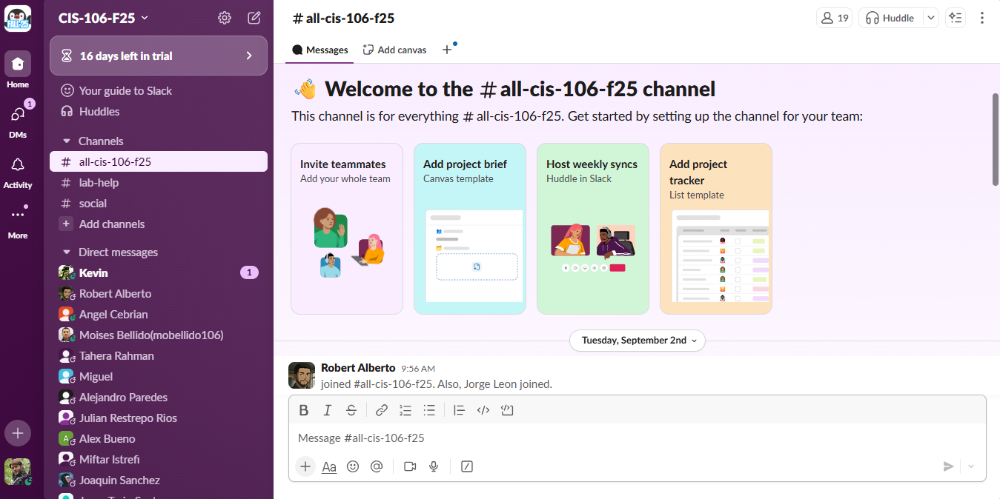
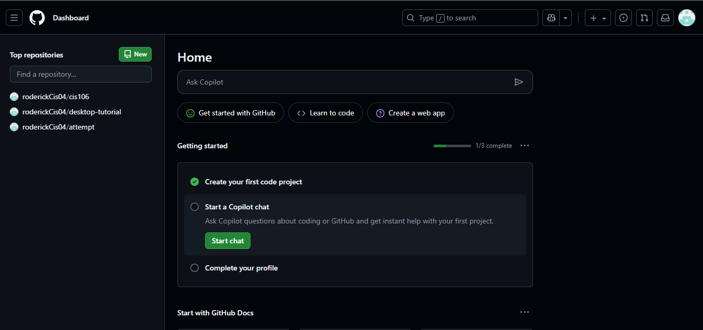

name: ***Roderick Tejada***
assignment: ***week report 1***
course: ***cis 106***
semester: ***fall 25***

# Week Report 1 Submission

## Slack Screenshot

### Github Screenshot 

#### Acknowledgements

By submitting this assignment I **Roderick Tejada** acknowledge that I have read the syllabus or home page of the course.

I also acknowledge that I have written down any questions that I have for the professor and will ask them in class or via Slack.

I also acknowledge that the Final exam is in person.