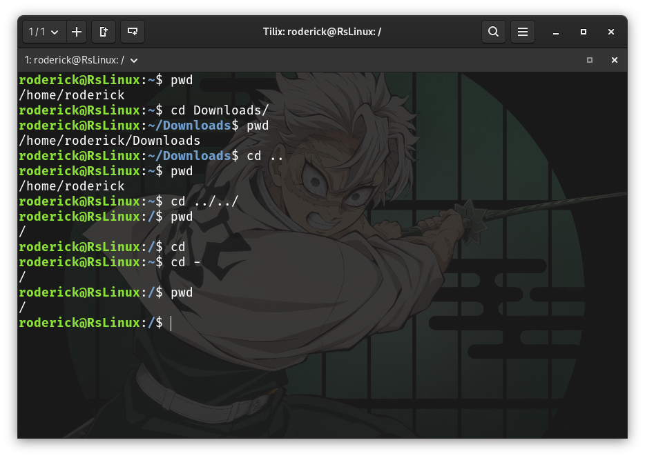
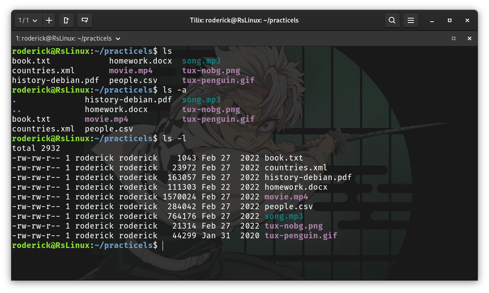
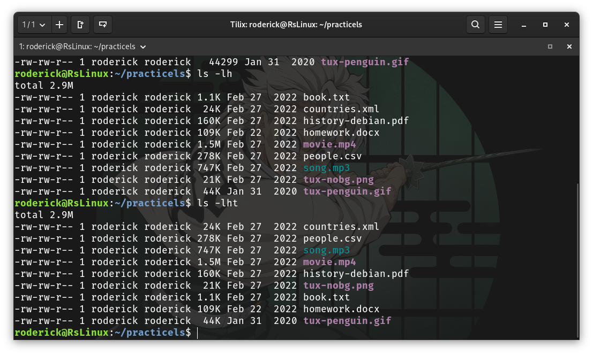
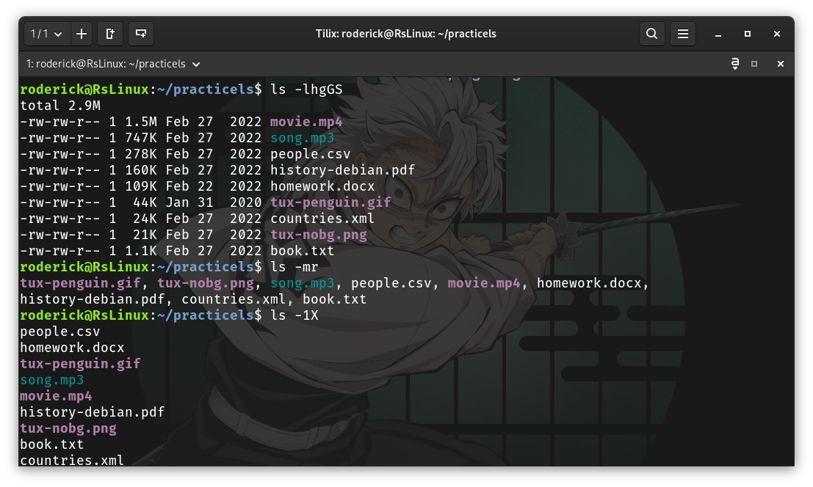
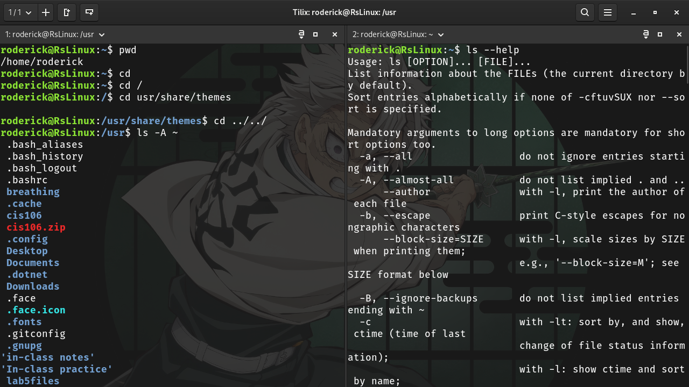
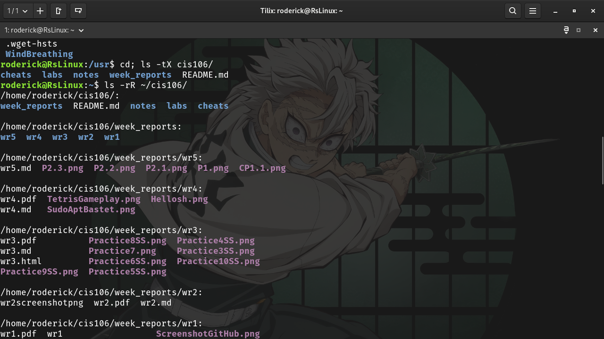
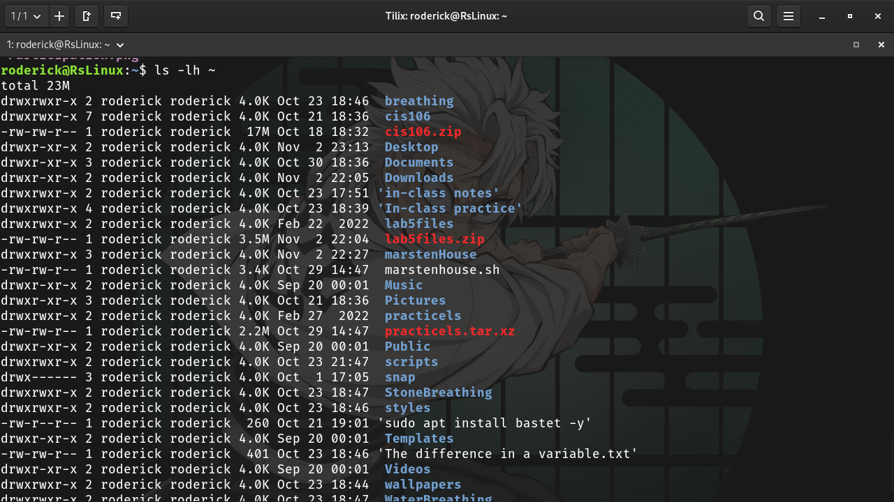
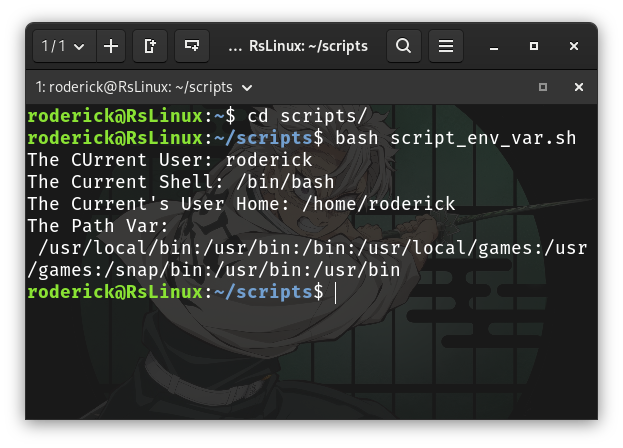

# Completed Week Report

## Discussion Board

History of Linux (Discussion Board 2)

## Notes and lab

* [Lab5](../../labs/lab5/lab5.md)
* [Notes5](../../notes/notes5/notes5.md)

## Practices

### Practice The Linux filesystem

#### Practice 1

#### Practice 2

#### Challenge Practice

### Shell encrypting

#### Practice 2

#### Practice 3